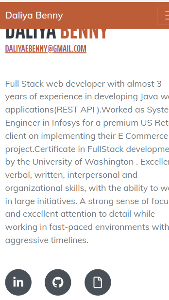
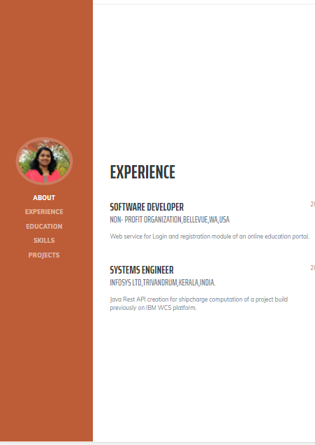
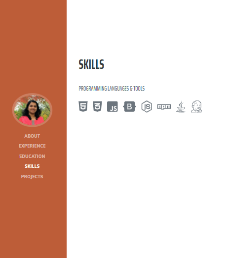
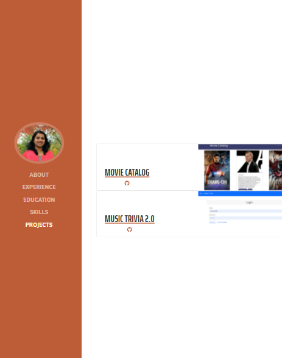

# Portfolio


A portfolio of work can showcase your skills and talents to employers looking to fill a part-time or full-time position. An effective portfolio highlights your strongest work as well as the thought processes behind it.


## User Story

```
AS A JOB SEEKER
I WANT to create and deploy my portfolio of work samples
SO THAT I can share it with employeers and exhiibit my skills
```

## Mock-Up

The following image shows the web application's appearance 

    
    
    
    
  


## Technology
HTML,CSS,JavaScript

### Links 
* [*GitHub repository*](https://github.com/daliyaebenny/Portfolio.git)   
* [*Deployed Application*](https://github.com/daliyaebenny/ReadMe-Generator/blob/main/result/README.md)


